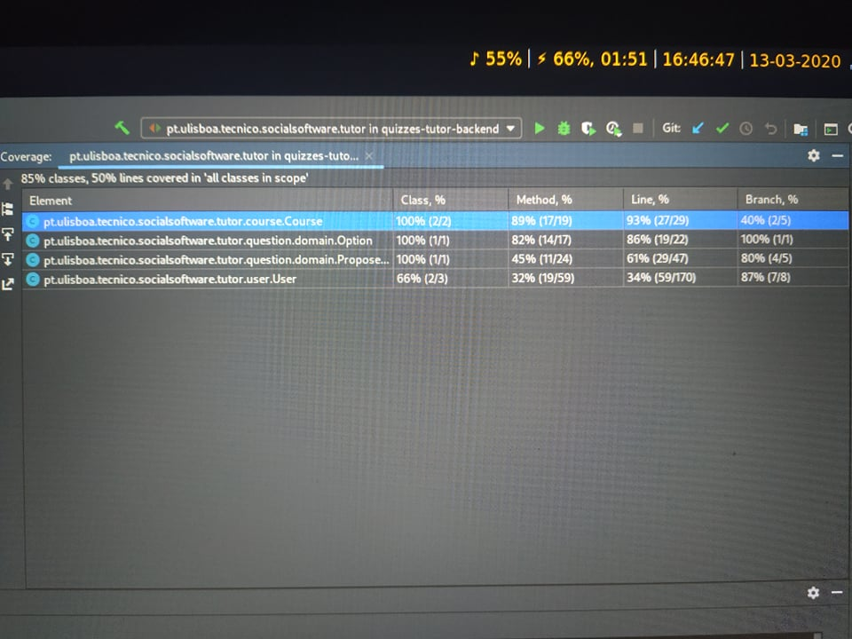
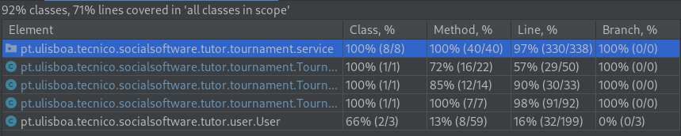

# ES20 P1 submission, Group NN

## Feature PPA

### Subgroup
 - Miguel Baptista, ist186481, 86481
   + Issues assigned: #11,#14,#25,#28
 
### Pull requests associated with this feature

The list of pull requests associated with this feature is:

 - PR #030

### New/Updated domain entities

#### New entities
 - ProposedQuestion.java

#### Entities changed
 - User.java
 - Course.java
 - Option.java
 
### Feature testing

We define one success test, one insuccess test, and tests for invalid input. The direct links to these are:

 - [SubmitQuestionTest.groovy]
    + Sucess test 1,2,3,4
    + Insuccess test 
    + Tests for invalid input 5,6,7

### Test Coverage Screenshot

The screenshot includes the test coverage results associated with the new/changed entities:

---

## Feature TDP

### Subgroup
 - Dora Lourenço, ist189437, DAL12
   + Issues assigned: Relacionados com listar torneios e inscrever em torneios
 - Mariana Brejo, ist189501, marianabrejo
   + Issues assigned: Relacionados com cancelar torneios
 - Henrique Guerra, ist189456, henriquebg99
   + Issues assigned: Relacionados com criar torneios
 
### Pull requests associated with this feature

The list of pull requests associated with this feature is:

 - [PR #017](https://github.com/tecnico-softeng/es20al_27-project/pull/17)
 - [PR #026](https://github.com/tecnico-softeng/es20al_27-project/pull/26)

### New/Updated domain entities

#### New entities
 - [Tournament.java](https://github.com/tecnico-softeng/es20al_27-project/blob/develop/backend/src/main/java/pt/ulisboa/tecnico/socialsoftware/tutor/tournament/Tournament.java)
 - [TournamentDto.java](https://github.com/tecnico-softeng/es20al_27-project/blob/develop/backend/src/main/java/pt/ulisboa/tecnico/socialsoftware/tutor/tournament/TournamentDto.java)
 - [TournamentRepository.java](https://github.com/tecnico-softeng/es20al_27-project/blob/develop/backend/src/main/java/pt/ulisboa/tecnico/socialsoftware/tutor/tournament/TournamentRepository.java)
 - [TournamentService.java](https://github.com/tecnico-softeng/es20al_27-project/blob/develop/backend/src/main/java/pt/ulisboa/tecnico/socialsoftware/tutor/tournament/TournamentService.java)

#### Entities changed
 - [User.java](https://github.com/tecnico-softeng/es20al_27-project/blob/develop/backend/src/main/java/pt/ulisboa/tecnico/socialsoftware/tutor/user/User.java)
   + Added field `tournaments`
   + Added field `enrolled_tournaments`
 
### Feature testing

We define one success test, one insuccess test, and tests for invalid input. The direct links to these are:

 - [CreateTournamentTest.groovy](https://github.com/tecnico-softeng/es20al_27-project/blob/develop/backend/src/test/groovy/pt/ulisboa/tecnico/socialsoftware/tutor/tournament/service/CreateTournamentTest.groovy)
    + [Success test](https://github.com/tecnico-softeng/es20al_27-project/blob/develop/backend/src/test/groovy/pt/ulisboa/tecnico/socialsoftware/tutor/tournament/service/CreateTournamentTest.groovy#L122)
    + [Insuccess test](https://github.com/tecnico-softeng/es20al_27-project/blob/develop/backend/src/test/groovy/pt/ulisboa/tecnico/socialsoftware/tutor/tournament/service/CreateTournamentTest.groovy#L198)
    + [Tests for invalid input](https://github.com/tecnico-softeng/es20al_27-project/blob/develop/backend/src/test/groovy/pt/ulisboa/tecnico/socialsoftware/tutor/tournament/service/CreateTournamentTest.groovy#L97)

### Test Coverage Screenshot

The screenshot includes the test coverage results associated with the new/changed entities:

