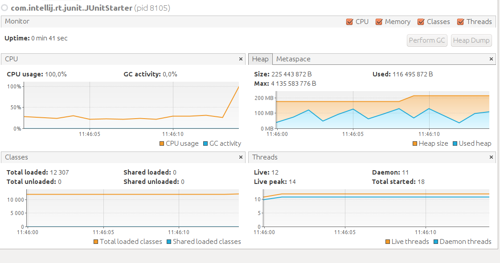

# ES20 P2 submission, Group NN

## Feature PPA

### Subgroup

 - Miguel Baptista, ist186481, 30030344
   + Issues assigned: [#36](https://github.com/tecnico-softeng/es20al_27-project/issues/36), 
                      [#41](https://github.com/tecnico-softeng/es20al_27-project/issues/41)

### Pull requests associated with this feature

The list of pull requests associated with this feature is:

 - [PR #43](https://github.com/tecnico-softeng/es20al_27-project/pull/43)

### Web services definition

#### Controllers
 - [Controller0](https://github.com/tecnico-softeng/es20al_27-project/blob/tdp/backend/src/main/java/pt/ulisboa/tecnico/socialsoftware/tutor/question/api/ProposedQuestionController.java)

### Feature testing

Each subgroup member defined one reading test and one writing test. The direct links to these are:

 - [WritingTestJMeter](https://github.com/tecnico-softeng/es20al_27-project/blob/tdp/backend/jmeter/proposedquestion/WSCreateProposedQuestionLoadTest.jmx)

#### Screenshots of Results Trees and DB cleanup

### Load testing

Each subgroup member defined one reading test and one writing test. The direct links to these are:

 - [ReadingTestJMeter](https://github.com)
 - [WritingTestJMeter](https://github.com)

#### Screenshots of Summary Reports and DB cleanup

### Service profiling

We used the [Async Profiler](https://www.jetbrains.com/help/idea/async-profiler.html).

#### Screenshots of summary reports

#### Discussion of findings

**TODO**: in the profiling segment of the project we found that most of the time spent by the
tests was accessing the data base

---

## Feature TDP

### Subgroup
 - Dora Lourenço, ist189437, 33807997
   + Issues assigned: [#32](https://github.com/tecnico-softeng/es20al_27-project/issues/32),
                      [#34](https://github.com/tecnico-softeng/es20al_27-project/issues/34),
                      [#35](https://github.com/tecnico-softeng/es20al_27-project/issues/35),
                      [#37](https://github.com/tecnico-softeng/es20al_27-project/issues/37)

 - Henrique Guerra, ist189456, 47252865
   + Issues assigned: [#33](https://github.com/tecnico-softeng/es20al_27-project/issues/33),
                      [#38](https://github.com/tecnico-softeng/es20al_27-project/issues/38)

 - Mariana Brejo, ist189501, 49107596
   + Issues assigned: [#39](https://github.com/tecnico-softeng/es20al_27-project/issues/39),
                      [#40](https://github.com/tecnico-softeng/es20al_27-project/issues/40)
 

### Pull requests associated with this feature

The list of pull requests associated with this feature is:

 - [PR #43](https://github.com/tecnico-softeng/es20al_27-project/pull/42)

### Web services definition

#### Controllers

 - [Controller0](https://github.com/tecnico-softeng/es20al_27-project/blob/tdp/backend/src/main/java/pt/ulisboa/tecnico/socialsoftware/tutor/tournament/TournamentController.java)

### Feature testing

Each subgroup member defined one reading test and one writing test. The direct links to these are:

 - [ReadingTestJMeter](https://github.com/tecnico-softeng/es20al_27-project/blob/tdp/backend/jmeter/tournaments/WSCreateTournamentTest.jmx)
 - [WritingTestJMeter](https://github.com/tecnico-softeng/es20al_27-project/blob/tdp/backend/jmeter/tournaments/WSEnrollTournamentTest.jmx)
 - [WritingTestJMeter](https://github.com/tecnico-softeng/es20al_27-project/blob/tdp/backend/jmeter/tournaments/WSListTournamentTest.jmx)
 - [WritingTestJMeter](https://github.com/tecnico-softeng/es20al_27-project/blob/tdp/backend/jmeter/tournaments/WSCancelTournamentTest.jmx)

#### Screenshots of Results Trees and DB cleanup

Create Tournament

Enroll Tournament

List Tournaments

Cancel Tournaments

### Load testing

Each subgroup member defined one reading test and one writing test. The direct links to these are:

 - [ReadingTestJMeter] (https://github.com/tecnico-softeng/es20al_27-project/blob/tdp/backend/jmeter/tournaments/WSCreateTournamentLoadTest.jmx)
 - [WritingTestJMeter](https://github.com/tecnico-softeng/es20al_27-project/blob/tdp/backend/jmeter/tournaments/WSEnrollTournamentLoadTest.jmx)
 - [WritingTestJMeter](https://github.com/tecnico-softeng/es20al_27-project/blob/tdp/backend/jmeter/tournaments/WSListTournamentLoadTest.jmx)
 - [WritingTestJMeter](https://github.com/tecnico-softeng/es20al_27-project/blob/tdp/backend/jmeter/tournaments/WSCancelTournamentLoadTest.jmx)

#### Screenshots of Summary Reports and DB cleanup

Create Tournament

Enroll Tournament

List Tournaments

Cancel Tournaments

### Service profiling

We used the [Async Profiler](https://www.jetbrains.com/help/idea/async-profiler.html).

#### Screenshots of summary reports

Create Tournament

Enroll Tournament

List Tournaments

Cancel Tournaments

#### Discussion of findings

**TODO**: in the profiling segment of the project we found that most of the time spent by the
tests was accessing the data base