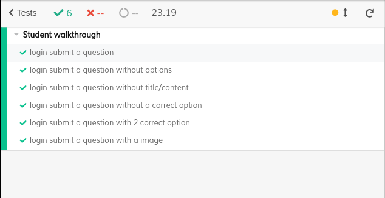
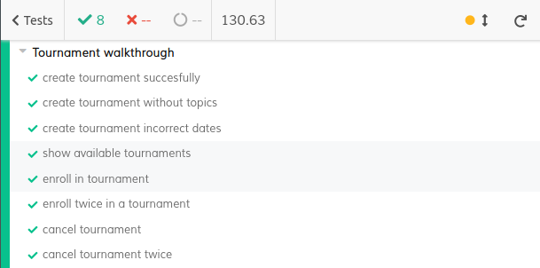

# ES20 P3 submission, Group 27

## Feature PPA

### Subgroup

 - Miguel Baptista, ist186481, 30030344
   + Issues assigned: [#55](https://github.com/tecnico-softeng/es20al_27-project/issues/55), 
                      [#56](https://github.com/tecnico-softeng/es20al_27-project/issues/56),
                      [#61](https://github.com/tecnico-softeng/es20al_27-project/issues/56)
 
### Pull requests associated with this feature

The list of pull requests associated with this feature is:

- [PR 63](https://github.com/tecnico-softeng/es20al_27-project/pull/63)

### Frontend

#### New/Updated Views

 - [Proposed Question View](https://github.com/tecnico-softeng/es20al_27-project/blob/ppa/frontend/src/views/student/ProposedQuestionView.vue)

#### New/Updated Models

 - [Proposed Question Model](https://github.com/tecnico-softeng/es20al_27-project/blob/ppa/frontend/src/models/management/ProposedQuestion.ts)

### End-to-end tests

#### Created tests

 - [Login submit a question](https://github.com/tecnico-softeng/es20al_27-project/blob/ppa/frontend/tests/e2e/integration/student/submitQuestion.js#L12)
 - [Login submit a question without options](https://github.com/tecnico-softeng/es20al_27-project/blob/ppa/frontend/tests/e2e/integration/student/submitQuestion.js#L23)
 - [Login submit a question without title/content](https://github.com/tecnico-softeng/es20al_27-project/blob/ppa/frontend/tests/e2e/integration/student/submitQuestion.js#L30)
 - [Login submit a question without a correct option](https://github.com/tecnico-softeng/es20al_27-project/blob/ppa/frontend/tests/e2e/integration/student/submitQuestion.js#40)
 - [Login submit a question with 2 correct option](https://github.com/tecnico-softeng/es20al_27-project/blob/ppa/frontend/tests/e2e/integration/student/submitQuestion.js#51)
 - [Login submit a question with a image](https://github.com/tecnico-softeng/es20al_27-project/blob/ppa/frontend/tests/e2e/integration/student/submitQuestion.js#64)

#### Rationale
End to end test permite simular o cenário do utilizador real e validar o sistema e os seus componentes em termos de integração.

#### Commands defined

 - [commands.js](https://github.com/tecnico-softeng/es20al_27-project/blob/tdp/frontend/tests/e2e/support/commands.js)

#### Screenshot of test results overview

---

## Feature TDP

### Subgroup

  - Dora Lourenço, ist189437, 33807997
   + Issues assigned: [#52](https://github.com/tecnico-softeng/es20al_27-project/issues/52),
                      [#53](https://github.com/tecnico-softeng/es20al_27-project/issues/53),
                      [#57](https://github.com/tecnico-softeng/es20al_27-project/issues/57),
                      [#58](https://github.com/tecnico-softeng/es20al_27-project/issues/58)

 - Henrique Guerra, ist189456, 47252865
   + Issues assigned: [#54](https://github.com/tecnico-softeng/es20al_27-project/issues/54),
                      [#59](https://github.com/tecnico-softeng/es20al_27-project/issues/59)

 - Mariana Brejo, ist189501, 49107596
   + Issues assigned: [#47](https://github.com/tecnico-softeng/es20al_27-project/issues/47),
                      [#51](https://github.com/tecnico-softeng/es20al_27-project/issues/51),
                      [#60](https://github.com/tecnico-softeng/es20al_27-project/issues/60)
 
### Pull requests associated with this feature

The list of pull requests associated with this feature is:

 - [PR #62](https://github.com/tecnico-softeng/es20al_27-project/pull/62)
 - [PR #64](https://github.com/tecnico-softeng/es20al_27-project/pull/64)

### Frontend

#### New/Updated Views

 - [Create Tournament View](https://github.com/tecnico-softeng/es20al_27-project/blob/tdp/frontend/src/views/student/CreateTournamentsView.vue)
 - [Available Tournament View](https://github.com/tecnico-softeng/es20al_27-project/blob/tdp/frontend/src/views/student/AvailableTournamentsView.vue)
 - [Cancel Tournament View](https://github.com/tecnico-softeng/es20al_27-project/blob/tdp/frontend/src/views/student/CancelTournamentsView.vue)

#### New/Updated Models

 - [Tournament Model](https://github.com/tecnico-softeng/es20al_27-project/blob/tdp/frontend/src/models/management/Tournament.ts)

### End-to-end tests

#### Created tests

 - [Create tournament succesfully](https://github.com/tecnico-softeng/es20al_27-project/blob/tdp/frontend/tests/e2e/specs/tournaments/manageTournaments.js#L11)
 - [Create tournament without topics](https://github.com/tecnico-softeng/es20al_27-project/blob/tdp/frontend/tests/e2e/specs/tournaments/manageTournaments.js#L16)
 - [Create tournament incorrect dates](https://github.com/tecnico-softeng/es20al_27-project/blob/tdp/frontend/tests/e2e/specs/tournaments/manageTournaments.js#L41)
 - [Show available tournaments](https://github.com/tecnico-softeng/es20al_27-project/blob/tdp/frontend/tests/e2e/specs/tournaments/manageTournaments.js#L63)
 - [Enroll in tournament](https://github.com/tecnico-softeng/es20al_27-project/blob/tdp/frontend/tests/e2e/specs/tournaments/manageTournaments.js#L67)
 - [Enroll twice in a tournament](https://github.com/tecnico-softeng/es20al_27-project/blob/tdp/frontend/tests/e2e/specs/tournaments/manageTournaments.js#L74)
 - [Cancel tournament](https://github.com/tecnico-softeng/es20al_27-project/blob/tdp/frontend/tests/e2e/specs/tournaments/manageTournaments.js#L83)
 - [Cancel tournament twice](https://github.com/tecnico-softeng/es20al_27-project/blob/tdp/frontend/tests/e2e/specs/tournaments/manageTournaments.js#L90)

#### Rationale
End to end test permite simular o cenário do utilizador real e validar o sistema e os seus componentes em termos de integração.

#### Commands defined

 - [Create Tournament](https://github.com/tecnico-softeng/es20al_27-project/blob/tdp/frontend/tests/e2e/support/commands.js#L97)
 - [Enroll Tournament](https://github.com/tecnico-softeng/es20al_27-project/blob/tdp/frontend/tests/e2e/support/commands.js#L62)
 - [Cancel Tournament](https://github.com/tecnico-softeng/es20al_27-project/blob/tdp/frontend/tests/e2e/support/commands.js#L120)
 - [Go to Create Tournaments](https://github.com/tecnico-softeng/es20al_27-project/blob/tdp/frontend/tests/e2e/support/commands.js#L44)
 - [Go to Available Tournaments](https://github.com/tecnico-softeng/es20al_27-project/blob/tdp/frontend/tests/e2e/support/commands.js#L39)
 - [Go to Cancel Tournaments](https://github.com/tecnico-softeng/es20al_27-project/blob/tdp/frontend/tests/e2e/support/commands.js#L49)

#### Screenshot of test results overview

