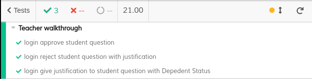
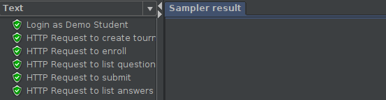
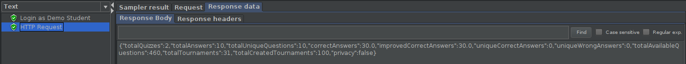
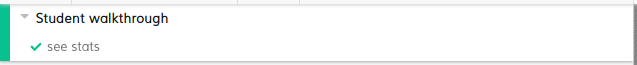
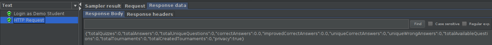
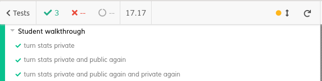
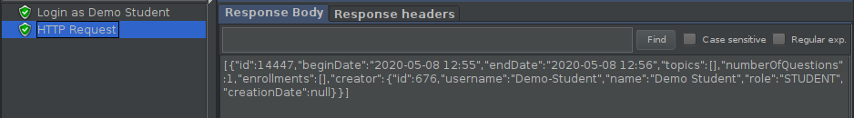

# ES20 P4 submission, Group 27

## Feature PPA

### Subgroup

  - Miguel Batista, ist186481, 30030344 
    + Issues assigned: 
        [#66](https://github.com/tecnico-softeng/es20al_27-project/issues/66), 
        [#67](https://github.com/tecnico-softeng/es20al_27-project/issues/67),
        [#68](https://github.com/tecnico-softeng/es20al_27-project/issues/68),
        [#69](https://github.com/tecnico-softeng/es20al_27-project/issues/69),
        [#70](https://github.com/tecnico-softeng/es20al_27-project/issues/70),
        [#76](https://github.com/tecnico-softeng/es20al_27-project/issues/76),
        [#84](https://github.com/tecnico-softeng/es20al_27-project/issues/84),
        [#85](https://github.com/tecnico-softeng/es20al_27-project/issues/85),
        [#106](https://github.com/tecnico-softeng/es20al_27-project/issues/106),
        [#107](https://github.com/tecnico-softeng/es20al_27-project/issues/107),
        [#111](https://github.com/tecnico-softeng/es20al_27-project/issues/111),
        [#112](https://github.com/tecnico-softeng/es20al_27-project/issues/112),
        [#113](https://github.com/tecnico-softeng/es20al_27-project/issues/113),
        [#114](https://github.com/tecnico-softeng/es20al_27-project/issues/114),
        [#115](https://github.com/tecnico-softeng/es20al_27-project/issues/115),
        [#116](https://github.com/tecnico-softeng/es20al_27-project/issues/116),
        [#117](https://github.com/tecnico-softeng/es20al_27-project/issues/117),
        [#118](https://github.com/tecnico-softeng/es20al_27-project/issues/118)
       
   + Tasks: F1(all tasks), F2(all tasks)
 
### Pull requests associated with this feature

The list of pull requests associated with this feature is:

 - [PR #121](https://github.com/tecnico-softeng/es20al_27-project/pull/121)

### Listed features

Below, we list **only** the implemented features. For each feature, we link the relevant files and we mark which are requested parts are completed.

#### Feature number 1: _Um docente pode aprovar ou rejeitar a pergunta, incluindo a sua justificação_

 - [x] [Service](https://github.com/tecnico-softeng/es20al_27-project/blob/ppa/backend/src/main/java/pt/ulisboa/tecnico/socialsoftware/tutor/question/ProposedQuestionService.java)
 - [x] [Spock tests](https://github.com/tecnico-softeng/es20al_27-project/blob/ppa/backend/src/test/groovy/pt/ulisboa/tecnico/socialsoftware/tutor/question/service/StatusChangeSubmitQuestionTest.groovy)
 - [ ] JMeter feature tests: does not apply 
 - [x] [Cypress use case test](https://github.com/tecnico-softeng/es20al_27-project/tree/ppa/frontend/tests/e2e/specs/teacher/studentQuestions.js)        
 
 + Screenshot: 
   
       
      
#### Feature number 2: _Uma questão aprovada pode passar a fazer parte do conjunto de perguntas disponíveis_

 - [x] [Service](https://github.com/tecnico-softeng/es20al_27-project/blob/ppa/backend/src/main/java/pt/ulisboa/tecnico/socialsoftware/tutor/question/ProposedQuestionService.java)
 - [x] [Spock tests](https://github.com/tecnico-softeng/es20al_27-project/blob/ppa/backend/src/test/groovy/pt/ulisboa/tecnico/socialsoftware/tutor/question/service/StatusChangeSubmitQuestionTest.groovy)
 - [ ] JMeter feature tests: does not apply 
 - [x] [Cypress use case test](https://github.com/tecnico-softeng/es20al_27-project/tree/ppa/frontend/tests/e2e/specs/teacher/studentQuestions.js)
      
 + Screenshot: 
   
      

## Feature TDP

### Subgroup

 - Dora Lourenço, ist189437, 33807997
   + Issues assigned: 
       [#86](https://github.com/tecnico-softeng/es20al_27-project/issues/86), 
       [#87](https://github.com/tecnico-softeng/es20al_27-project/issues/87),
       [#88](https://github.com/tecnico-softeng/es20al_27-project/issues/88),
       [#89](https://github.com/tecnico-softeng/es20al_27-project/issues/89),
       [#110](https://github.com/tecnico-softeng/es20al_27-project/issues/110),
       [#119](https://github.com/tecnico-softeng/es20al_27-project/issues/119),
       [#120](https://github.com/tecnico-softeng/es20al_27-project/issues/120)
       
   + Tasks: F7(all tasks), F4:all tasks concerning an additional service of 
   listing tournaments for participation 
   
 - Henrique Guerra, ist189456, 47252865
   + Issues assigned: 
        [#82](https://github.com/tecnico-softeng/es20al_27-project/issues/82), 
        [#109](https://github.com/tecnico-softeng/es20al_27-project/issues/109),
        [#108](https://github.com/tecnico-softeng/es20al_27-project/issues/108),
        [#97](https://github.com/tecnico-softeng/es20al_27-project/issues/97),
        [#75](https://github.com/tecnico-softeng/es20al_27-project/issues/75),
        [#77](https://github.com/tecnico-softeng/es20al_27-project/issues/77),
        [#78](https://github.com/tecnico-softeng/es20al_27-project/issues/78),
        [#79](https://github.com/tecnico-softeng/es20al_27-project/issues/79),
        [#74](https://github.com/tecnico-softeng/es20al_27-project/issues/74),
        [#81](https://github.com/tecnico-softeng/es20al_27-project/issues/81),
        [#110](https://github.com/tecnico-softeng/es20al_27-project/issues/110)
        
   + Tasks: F3(all tasks), F4:all tasks not concerning an additional service of 
   listing tournaments for participation 
   
  - Mariana Brejo, ist189501, 49107596
    + Issues assigned: 
        [#103](https://github.com/tecnico-softeng/es20al_27-project/issues/103), 
        [#92](https://github.com/tecnico-softeng/es20al_27-project/issues/92),
        [#105](https://github.com/tecnico-softeng/es20al_27-project/issues/105),
        [#98](https://github.com/tecnico-softeng/es20al_27-project/issues/98),
        [#99](https://github.com/tecnico-softeng/es20al_27-project/issues/99),
        [#101](https://github.com/tecnico-softeng/es20al_27-project/issues/101),
        [#100](https://github.com/tecnico-softeng/es20al_27-project/issues/100),
        [#96](https://github.com/tecnico-softeng/es20al_27-project/issues/96),
        [#95](https://github.com/tecnico-softeng/es20al_27-project/issues/95),
        [#94](https://github.com/tecnico-softeng/es20al_27-project/issues/94),
        [#93](https://github.com/tecnico-softeng/es20al_27-project/issues/93),
        [#80](https://github.com/tecnico-softeng/es20al_27-project/issues/80),
        [#73](https://github.com/tecnico-softeng/es20al_27-project/issues/73),
        [#102](https://github.com/tecnico-softeng/es20al_27-project/issues/102),
        [#104](https://github.com/tecnico-softeng/es20al_27-project/issues/104)
           
    + Tasks: F5(all tasks), F6(all tasks)

### Pull requests associated with this feature

The list of pull requests associated with this feature is:

 - [PR #122](https://github.com/tecnico-softeng/es20al_27-project/pull/122)

### Listed features

Below, we list **only** the implemented features. For each feature, we link the relevant files and we mark which are requested parts are completed.

#### Feature number 3: _Se o número de alunos inscritos, incluindo o criador do torneio, for superior a 1, o sistema gera o quiz associado ao torneio_

 - [x] [Service](https://github.com/tecnico-softeng/es20al_27-project/blob/master/backend/src/main/java/pt/ulisboa/tecnico/socialsoftware/tutor/tournament/TournamentService.java)
 - [x] [Spock tests](https://github.com/tecnico-softeng/es20al_27-project/blob/tdp/backend/src/test/groovy/pt/ulisboa/tecnico/socialsoftware/tutor/tournament/service/GenerateQuestionsTest.groovy)
 - [ ] JMeter feature tests: does not apply
 - [ ] Cypress use case test: does not apply

#### Feature number 4: _Os alunos participantes respondem às perguntas no período definido para o torneio_

 - [x] [Service](https://github.com/tecnico-softeng/es20al_27-project/blob/master/backend/src/main/java/pt/ulisboa/tecnico/socialsoftware/tutor/tournament/TournamentService.java)
 - [x] Spock tests
    [#1](https://github.com/tecnico-softeng/es20al_27-project/blob/tdp/backend/src/test/groovy/pt/ulisboa/tecnico/socialsoftware/tutor/tournament/service/SubmitAnswerTest.groovy)
    [#2](https://github.com/tecnico-softeng/es20al_27-project/blob/tdp/backend/src/test/groovy/pt/ulisboa/tecnico/socialsoftware/tutor/tournament/service/SubmitAnswerPerformanceTest.groovy)
 - [x] JMeter feature tests
    [#1](https://github.com/tecnico-softeng/es20al_27-project/blob/tdp/backend/jmeter/tournaments/WSSubmitAnswerTest.jmx)
    [#2](https://github.com/tecnico-softeng/es20al_27-project/blob/tdp/backend/jmeter/tournaments/WSSubmitAnswerLoadTest.jmx)
   + Screenshots:
      
     
     
 - [ ] Cypress use case test: does not apply
     
#### Feature number 5: _Existe um dashboard do aluno onde é apresentada informação acerca dos torneios em que participou e qual a sua pontuação_

 - [x] [Service](https://github.com/tecnico-softeng/es20al_27-project/blob/master/backend/src/main/java/pt/ulisboa/tecnico/socialsoftware/tutor/tournament/TournamentService.java)
 - [x] Spock tests
    [#1](https://github.com/tecnico-softeng/es20al_27-project/blob/tdp/backend/src/test/groovy/pt/ulisboa/tecnico/socialsoftware/tutor/statistics/StatisticsTest.groovy)
    [#2](https://github.com/tecnico-softeng/es20al_27-project/blob/tdp/backend/src/test/groovy/pt/ulisboa/tecnico/socialsoftware/tutor/statistics/StatisticsPerformanceTest.groovy)
 - [x] JMeter feature tests
    [#1](https://github.com/tecnico-softeng/es20al_27-project/blob/tdp/backend/jmeter/statistics/WSStatisticsTest.jmx)
    [#2](https://github.com/tecnico-softeng/es20al_27-project/blob/tdp/backend/jmeter/statistics/WStatisticsLoadTest.jmx)
    
   + Screenshots:
      
     
     
 - [x] [Cypress use case tests](https://github.com/tecnico-softeng/es20al_27-project/blob/tdp/frontend/tests/e2e/specs/student/manageStatistics.js)

   + Screenshot: 
   
     
     
#### Feature number 6: _O aluno decide se esta informação no seu dashboard deve ser pública ou privada_

 - [x] [Service](https://github.com/tecnico-softeng/es20al_27-project/blob/master/backend/src/main/java/pt/ulisboa/tecnico/socialsoftware/tutor/tournament/TournamentService.java)
 - [x] Spock tests
    [#1](https://github.com/tecnico-softeng/es20al_27-project/blob/tdp/backend/src/test/groovy/pt/ulisboa/tecnico/socialsoftware/tutor/statistics/PrivacyStatisticsTest.groovy)
    [#2](https://github.com/tecnico-softeng/es20al_27-project/blob/tdp/backend/src/test/groovy/pt/ulisboa/tecnico/socialsoftware/tutor/statistics/PrivacyStatisticsPerformanceTest.groovy)
 - [x] JMeter feature tests
    [#1](https://github.com/tecnico-softeng/es20al_27-project/blob/tdp/backend/jmeter/statistics/WSPrivacyStatisticsTest.jmx)
    [#2](https://github.com/tecnico-softeng/es20al_27-project/blob/tdp/backend/jmeter/statistics/WSPrivacyStatisticsLoadTest.jmx)
   + Screenshots:
      
     
     
 - [x] [Cypress use case test](https://github.com/tecnico-softeng/es20al_27-project/blob/tdp/frontend/tests/e2e/specs/student/manageStatisticsPrivacy.js)
   + Screenshot:
   
     

### Additional features

#### Feature number 7: _Listar os torneios fechados e dados dos mesmos_

 - [x] [Service](https://github.com/tecnico-softeng/es20al_27-project/blob/master/backend/src/main/java/pt/ulisboa/tecnico/socialsoftware/tutor/tournament/TournamentService.java)
 - [x] Spock tests
    [#1](https://github.com/tecnico-softeng/es20al_27-project/blob/tdp/backend/src/test/groovy/pt/ulisboa/tecnico/socialsoftware/tutor/tournament/service/ListClosedTournamentsTest.groovy)
    [#2](https://github.com/tecnico-softeng/es20al_27-project/blob/tdp/backend/src/test/groovy/pt/ulisboa/tecnico/socialsoftware/tutor/tournament/service/ListClosedTournamentsPerformanceTest.groovy)
 - [x] JMeter feature tests
    [#1](https://github.com/tecnico-softeng/es20al_27-project/blob/tdp/backend/jmeter/tournaments/WSListClosedTournamentsTest.jmx)
    [#2](https://github.com/tecnico-softeng/es20al_27-project/blob/tdp/backend/jmeter/tournaments/WSListClosedTournamentsLoadTest.jmx)

   + Screenshots:
      
     
     
 - [x] [Cypress use case test](https://github.com/tecnico-softeng/es20al_27-project/blob/tdp/frontend/tests/e2e/specs/tournaments/manageTournaments.js)
   + Screenshot:
   
     

---
